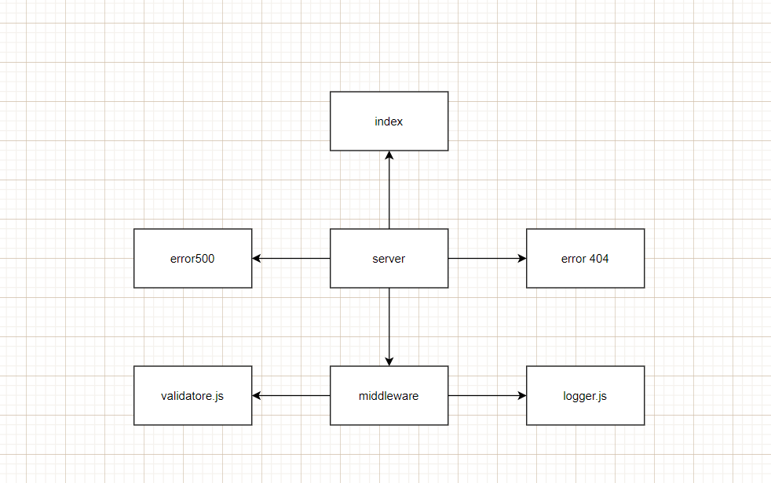

# basic-express-server


## About 
 a middleware folder and add 2 middleware modules to it and Path: /person
<hr>

## Author
 Ahmad Arman
<hr>

## Links
* 
 * [ REPOSITORY](https://github.com/ahmad-arman/basic-express-server)<br>
 *  [Heroku](https://ahmadbasic-express-server.herokuapp.com/)<br>
 * [PULL REQUEST](https://github.com/ahmad-arman/basic-express-server/pull/5)<br>
<hr>

## Setup
1. `(.env)` file 
```
PORT = 3000

```
2. Install the following dependencies
```
npm init -y 
 "dependencies": {
    "dotenv": "^9.0.2",
    "express": "^4.17.1"
  },
  "devDependencies": {
    "eslint": "^7.26.0",
    "jest": "^26.6.3",
    "supertest": "^6.1.3"
  }
```
## Running the app 
1. clone the repo.
2. Enter the command `npm start`
3. Use endpoints :
   ## Food
  ### * `/person`
<br>

- **Method** : GET 
- **CRUD Operation** : https://ahmadbasic-express-server.herokuapp.com/person?name=ahmad
- **Response Body**   : JSON
```
[
    {
        
        "name": "ahmad",
        
    },
   
]
```
<br>

4. Test . 
* There's 2 test files . logger.test.js and validator.test.js
* In terminal run :
```
npm test
```
<br><br><br>
<hr>
<br><br>

## UML Diagram

